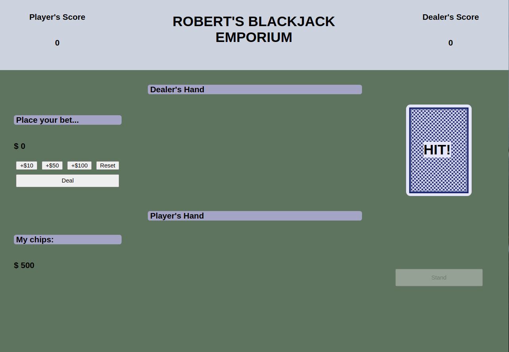

# General Assembly Project 1 - Blackjack
Robert's Blackjack Emporium


Introduction

The goal of this project is to demonstrate the application of foundational HTML, CSS, and JavaScript and aiming to follow the MVC architectual approach.

During the making of this project, emphasis was on organized code, especially in Javascript and with lots of comment to guide reader. 





Game Play:

Very simple. 
1. The game starts with the bet. This can be set on the left side, with the starting amount of $500. When amount is set, clicking "Deal" will start the game.

2. Two cards are dealt to the player and two for the dealer. The dealer has one card facing down. At this point, the user the option of drawing another card with the "Hit!" button or calling stopping by pressing the "Stand" button. 

3. On the dealer's turn the dealer's turn their cards will be displayed one by one as they're drawn.

4. Whether the player wins of looses, will be displayed as the cards drawn. If the player wins can with the amount of their bet. If the player wins with natural black jack they will win they will win 1.5 times the amount they bet. 


Notable lessons:

Currently this game is programmed to used one deck. The deck is created with nested loops based on suits and ranks. Cards are created using a class. 

```
class Card {
    constructor(rank, suit, value, imgFront) {
        this.rank = rank;
        this.suit = suit;
        this.value = value;
        this.imgFront = imgFront;  
        this.imgBack = imgBack;   // default
        this.faceDown = false; //default
    }
}
```

An image of a card can act as a button using event listener.

```
deckEl.addEventListener('click', function(){
    if(endOfGame == false){
        drawCard(player);
    }
});
```

At end of game, if player looses all their money, a modal window displays a message.
```
    <!-- css -->
	z-index: 1; /* Sit on top */
```

 ```
    <!-- js -->
    // End of game dialog
    if(chipAmount == 0) {
        mdlEl.style.display = "block";
    }
```


Future updates:
-improved visual design (also mobile friendly)
-multiple decks (with red and blue backs)
-player to choose Ace value in certain situations (1 or 11)


